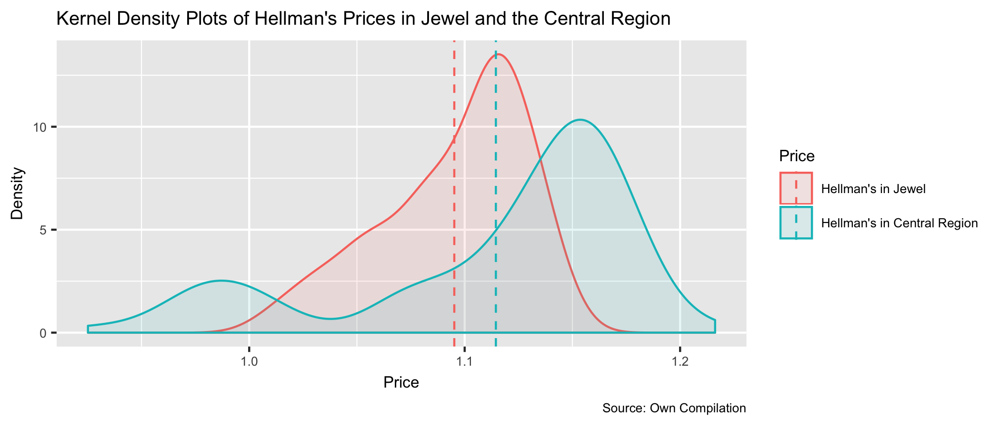
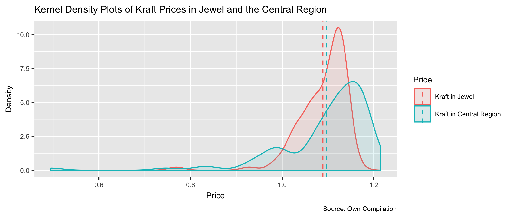
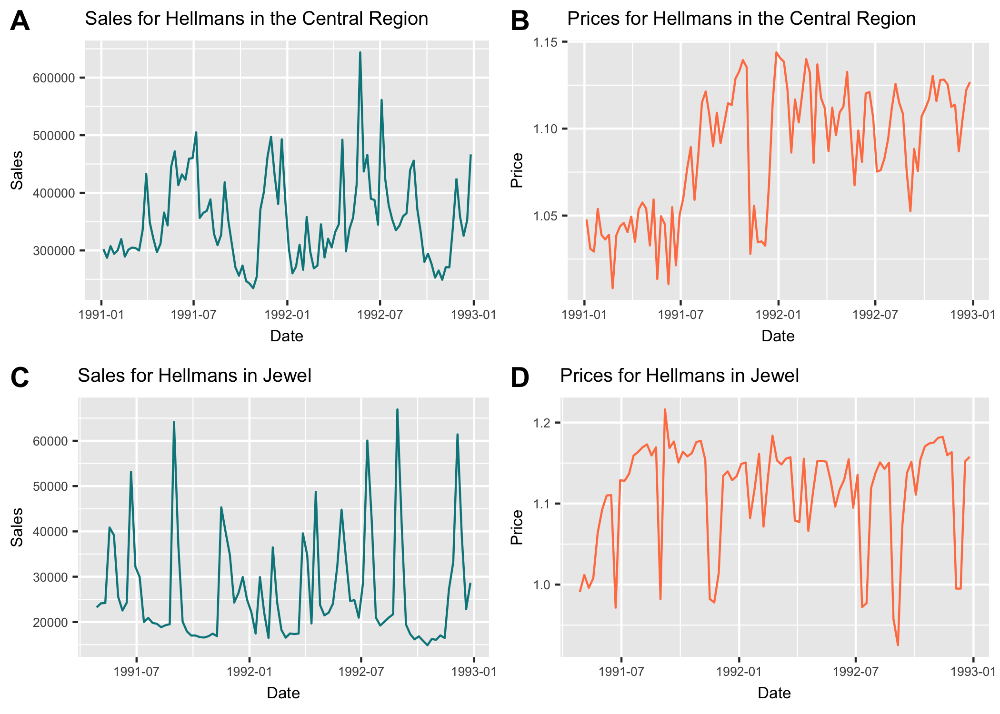
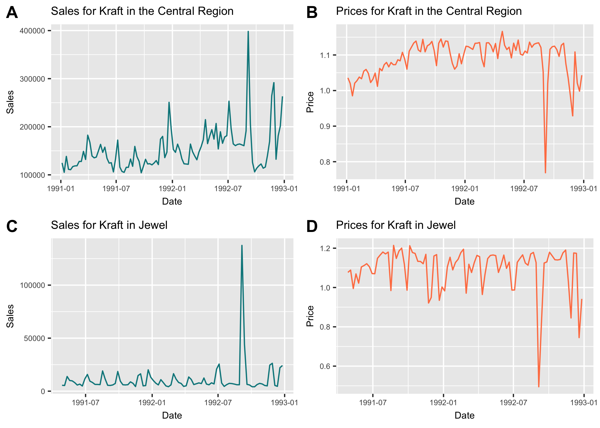
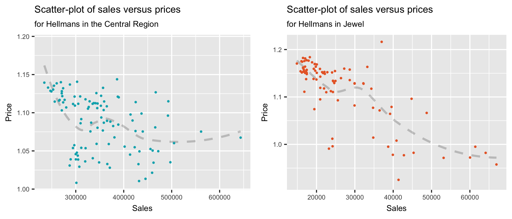
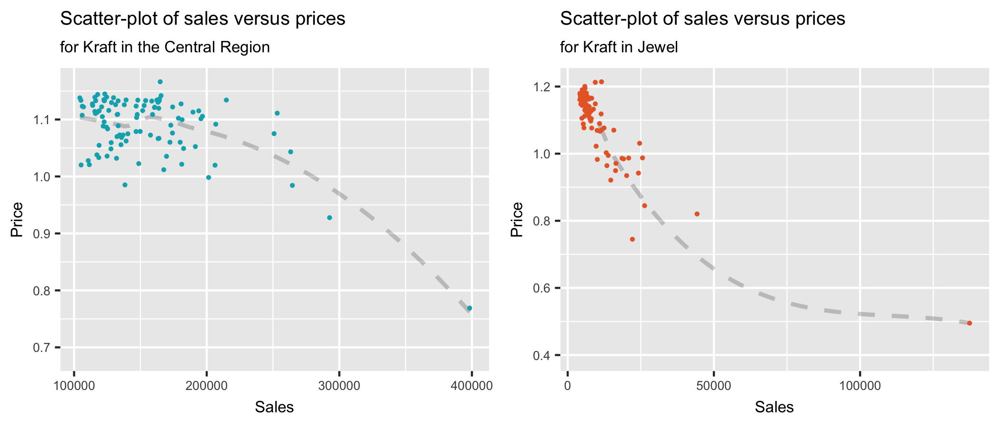

<div id="logo-container">

</div>
<style>
.list-group-item.active, .list-group-item.active:focus, .list-group-item.active:hover {
    background-color: #0399a8;
}
</style>


## Data Check

##### 1. Construct a price variable by dividing $ sales by unit sales (employ the `sales_$` and `sales_u` variables). Explain how to interpret this price variable (i.e. what sort of average price is this?).


```r
price <- mydata$Sales_USD/mydata$Sales_U  # See `createVariables` function in `ex1hints.R`. 
```
The constructed 'price' varible is the average price of one unit (equivalent units (lbs)) of the item in USD($).

##### 2. Compute the mean prices across weeks of Hellman's in Jewel and the Central Region. Are they comparable? Repeat the exercise for Kraft in Jewel and the Central Region. {.tabset}

###### Hellman's

```r
df_hellman <- na.omit(cbind(hellman_at_jewel$price, hellman_at_central$price)) %>% 
  as.data.frame() %>% 
  rename(hellman_at_jewel_price = V1,
         hellman_at_central_price = V2) %>% 
  gather(region, value)

mu_hellman <- df_hellman %>% group_by(region) %>% summarize(grp_mean = mean(value))

t_test_hellman <- t.test(value ~ region, data = df_hellman)
```



The mean price of Hellman's in the Jewel Region is \$1.114 while the mean price of Hellman's in the Central Region is \$1.095. These prices seem comparable. However, after conducting a two-tailed t-test one finds that the means are significantly different at a approximaly a 2% level of significance (p-value =0.017).

###### Kraft

```r
df_kraft <- na.omit(cbind(kraft_at_jewel$price, kraft_at_central$price)) %>% 
  as.data.frame() %>% 
  rename(kraft_at_jewel_price = V1,
         kraft_at_central_price = V2) %>% 
  gather(region, value)

mu_kraft <- df_kraft %>% group_by(region) %>% summarize(grp_mean = mean(value))

t_test_kraft <- t.test(value ~ region, data = df_kraft)
```



The mean price of Kraft in the Jewel Region is \$1.095 while the mean price of Kraft in the Central Region is \$1.099. These prices are comparable and after conducting a two-tailed t-test one finds that the means are not significantly different from one another (p-value =0.017).

##### 3. Price variation: Compute the standard deviation of prices across weeks of Hellman's in Jewel and the Central Region. Is there more price variation at Jewel or in the Central Region? Why? What does this tell you upfront about your ability to estimate price elasticities with either account level data or data in a large geographic market? Repeat the exercise for Kraft in Jewel and the Central Region. 


```r
sd_hellman <- df_hellman %>% group_by(region) %>% summarize(grp_sd = sd(value))
sd_kraft <- df_kraft %>% group_by(region) %>% summarize(grp_sd = sd(value))
```

The standard deviation for Hellman's in the Jewel region is noticeably greater than in the Central region. (0.067 vs 0.033 standard deviation respectivly). Similarily, the standard deviation for Kraft in the Jewel region is significantly larger than in the Central region. (0.112 and 0.053 standard deviation respectivly)

What does this tell you upfront about your ability to estimate price elasticities?

##### 4. Price plots: Construct time-series plots of sales and prices for Hellman's in the Central division and for Jewel (i.e. weeks on the X-axis, prices and unit-sales on the Y-axis). Repeat the exercise for Kraft. Describe the differences or similarities between Kraft and Hellman's pricing policies in each account. {.tabset}

###### Hellman's


###### Kraft


##### 5. Scatter-plots: Construct scatter-plots of sales versus prices for Hellman's in the Central division and for Jewel (i.e. prices on the Y-axis, unit-sales on the X-axis). Repeat the exercise for Kraft. Is there evidence for a negatively sloped demand-curve in the data? Eye-balling these plots, does demand appear more elastic in the Central Region or at Jewel (for either Hellman's or Kraft)? {.tabset}

###### Hellman's


###### Kraft


## Demand Estimation

##### 1. Fit the "multiplicative" demand model discussed in class for Kraft and Hellman's at Jewel (i.e. 2 separate regressions, one for Hellman's, and one for Kraft). {.tabset}

###### Hellman at Jewel 

```r
model_1 <- runRegression(hellman_at_jewel)
```

<table style="text-align:center"><caption><strong>Sales of Hellman at Jewel</strong></caption>
<tr><td colspan="2" style="border-bottom: 1px solid black"></td></tr><tr><td style="text-align:left"></td><td>ln(Hellman Sales)</td></tr>
<tr><td style="text-align:left"></td><td><em>OLS</em></td></tr>
<tr><td colspan="2" style="border-bottom: 1px solid black"></td></tr><tr><td style="text-align:left">ln(Hellman price)</td><td>-4.580<sup>***</sup></td></tr>
<tr><td style="text-align:left"></td><td>(0.427)</td></tr>
<tr><td style="text-align:left"></td><td></td></tr>
<tr><td style="text-align:left">Constant</td><td>10.600<sup>***</sup></td></tr>
<tr><td style="text-align:left"></td><td>(0.053)</td></tr>
<tr><td style="text-align:left"></td><td></td></tr>
<tr><td colspan="2" style="border-bottom: 1px solid black"></td></tr><tr><td style="text-align:left">Observations</td><td>88</td></tr>
<tr><td style="text-align:left">R<sup>2</sup></td><td>0.573</td></tr>
<tr><td style="text-align:left">Adjusted R<sup>2</sup></td><td>0.568</td></tr>
<tr><td style="text-align:left">Residual Std. Error</td><td>0.248 (df = 86)</td></tr>
<tr><td style="text-align:left">F Statistic</td><td>115.000<sup>***</sup> (df = 1; 86)</td></tr>
<tr><td colspan="2" style="border-bottom: 1px solid black"></td></tr><tr><td style="text-align:left"><em>Note:</em></td><td style="text-align:right"><sup>*</sup>p<0.1; <sup>**</sup>p<0.05; <sup>***</sup>p<0.01</td></tr>
</table>
<details>
  <summary>Estimated Equation</summary>
  $\left.\begin{aligned} \log ( Q ) & = \alpha + \beta \log ( P ) + \epsilon , \text { where } \\ \alpha & = \log ( A ) \\ \beta & = - \eta \end{aligned} \right.$
</details>

###### Kraft at Jewel 

```r
model_2 <- runRegression(kraft_at_jewel)
```


<table style="text-align:center"><caption><strong>Sales of Kraft at Jewel</strong></caption>
<tr><td colspan="2" style="border-bottom: 1px solid black"></td></tr><tr><td style="text-align:left"></td><td>ln(Kraft Sales)</td></tr>
<tr><td style="text-align:left"></td><td><em>OLS</em></td></tr>
<tr><td colspan="2" style="border-bottom: 1px solid black"></td></tr><tr><td style="text-align:left">ln(Kraft price)</td><td>-4.170<sup>***</sup></td></tr>
<tr><td style="text-align:left"></td><td>(0.254)</td></tr>
<tr><td style="text-align:left"></td><td></td></tr>
<tr><td style="text-align:left">Constant</td><td>9.400<sup>***</sup></td></tr>
<tr><td style="text-align:left"></td><td>(0.038)</td></tr>
<tr><td style="text-align:left"></td><td></td></tr>
<tr><td colspan="2" style="border-bottom: 1px solid black"></td></tr><tr><td style="text-align:left">Observations</td><td>88</td></tr>
<tr><td style="text-align:left">R<sup>2</sup></td><td>0.758</td></tr>
<tr><td style="text-align:left">Adjusted R<sup>2</sup></td><td>0.756</td></tr>
<tr><td style="text-align:left">Residual Std. Error</td><td>0.292 (df = 86)</td></tr>
<tr><td style="text-align:left">F Statistic</td><td>270.000<sup>***</sup> (df = 1; 86)</td></tr>
<tr><td colspan="2" style="border-bottom: 1px solid black"></td></tr><tr><td style="text-align:left"><em>Note:</em></td><td style="text-align:right"><sup>*</sup>p<0.1; <sup>**</sup>p<0.05; <sup>***</sup>p<0.01</td></tr>
</table>
<details>
  <summary>Estimated Equation</summary>
  $\left.\begin{aligned} \log ( Q ) & = \alpha + \beta \log ( P ) + \epsilon , \text { where } \\ \alpha & = \log ( A ) \\ \beta & = - \eta \end{aligned} \right.$
</details>

##### 2. Fit the "multiplicative" demand model discussed in class for Kraft and Hellman's for the Central Region (i.e. 2 separate regressions, one for Hellman's, and one for Kraft). {.tabset}

###### Hellman at Central 

```r
model_3 <- runRegression(hellman_at_central)
```

<table style="text-align:center"><caption><strong>Sales of Hellman at Central</strong></caption>
<tr><td colspan="2" style="border-bottom: 1px solid black"></td></tr><tr><td style="text-align:left"></td><td>ln(Hellman Sales)</td></tr>
<tr><td style="text-align:left"></td><td><em>OLS</em></td></tr>
<tr><td colspan="2" style="border-bottom: 1px solid black"></td></tr><tr><td style="text-align:left">ln(Hellman price)</td><td>-2.380<sup>***</sup></td></tr>
<tr><td style="text-align:left"></td><td>(0.551)</td></tr>
<tr><td style="text-align:left"></td><td></td></tr>
<tr><td style="text-align:left">Constant</td><td>12.900<sup>***</sup></td></tr>
<tr><td style="text-align:left"></td><td>(0.049)</td></tr>
<tr><td style="text-align:left"></td><td></td></tr>
<tr><td colspan="2" style="border-bottom: 1px solid black"></td></tr><tr><td style="text-align:left">Observations</td><td>104</td></tr>
<tr><td style="text-align:left">R<sup>2</sup></td><td>0.154</td></tr>
<tr><td style="text-align:left">Adjusted R<sup>2</sup></td><td>0.146</td></tr>
<tr><td style="text-align:left">Residual Std. Error</td><td>0.190 (df = 102)</td></tr>
<tr><td style="text-align:left">F Statistic</td><td>18.600<sup>***</sup> (df = 1; 102)</td></tr>
<tr><td colspan="2" style="border-bottom: 1px solid black"></td></tr><tr><td style="text-align:left"><em>Note:</em></td><td style="text-align:right"><sup>*</sup>p<0.1; <sup>**</sup>p<0.05; <sup>***</sup>p<0.01</td></tr>
</table>

###### Kraft at Central

```r
model_4 <- runRegression(kraft_at_central)
```

<table style="text-align:center"><caption><strong>Sales of Kraft at Central</strong></caption>
<tr><td colspan="2" style="border-bottom: 1px solid black"></td></tr><tr><td style="text-align:left"></td><td>ln(Kraft Sales)</td></tr>
<tr><td style="text-align:left"></td><td><em>OLS</em></td></tr>
<tr><td colspan="2" style="border-bottom: 1px solid black"></td></tr><tr><td style="text-align:left">ln(Kraft price)</td><td>-2.110<sup>***</sup></td></tr>
<tr><td style="text-align:left"></td><td>(0.401)</td></tr>
<tr><td style="text-align:left"></td><td></td></tr>
<tr><td style="text-align:left">Constant</td><td>12.100<sup>***</sup></td></tr>
<tr><td style="text-align:left"></td><td>(0.040)</td></tr>
<tr><td style="text-align:left"></td><td></td></tr>
<tr><td colspan="2" style="border-bottom: 1px solid black"></td></tr><tr><td style="text-align:left">Observations</td><td>104</td></tr>
<tr><td style="text-align:left">R<sup>2</sup></td><td>0.213</td></tr>
<tr><td style="text-align:left">Adjusted R<sup>2</sup></td><td>0.205</td></tr>
<tr><td style="text-align:left">Residual Std. Error</td><td>0.218 (df = 102)</td></tr>
<tr><td style="text-align:left">F Statistic</td><td>27.600<sup>***</sup> (df = 1; 102)</td></tr>
<tr><td colspan="2" style="border-bottom: 1px solid black"></td></tr><tr><td style="text-align:left"><em>Note:</em></td><td style="text-align:right"><sup>*</sup>p<0.1; <sup>**</sup>p<0.05; <sup>***</sup>p<0.01</td></tr>
</table>

##### 3. Elasticity differences: Is the demand elasticity higher (in absolute magnitude) at the Jewel account or in the Central Region? Can you offer some compelling explanations for the difference? (think of as many potential reasons as possible) 

##### 4. Forecasting demand under a price change: Using your regression results from the multiplicative demand model, compute the % change in unit sales for a 10% increase in the price of Kraft and Hellman's at Jewel. (Note: You can do this brute force in Excel, but for your benefit you should try to compute this on a sheet of paper with the help of a calculator). {.tabset}

###### Hellman at Jewel 

```r
# To get the proportional change in Y associated with a p percent increase in X, calculate
# a = ([100 + p]/100) and take a^β
price_coeff <- tidy_model_1$estimate[2]

compute_change <- function(percent_change, price_coeff) {
  a <- ((100 + percent_change)/100)
  price_effect <- a^price_coeff
  if (price_effect < 1) {
  prop <- round((1-price_effect)*100, digits = 2)
  direction <- "% decrease"
  }  else {
  prop <- round((price_effect - 1)*100, digits = 2)
  direction <- "% increase"
  }
  return(list(phrase = (paste0(prop, direction)), numeric = prop))
}

change_hellman <- compute_change(10, price_coeff)
```

Therefore, a 10% increase in the price of Hellman's at Jewel results in a 35.39% decrease in unit sales of Hellman's at Jewel ceteris paribus.

###### Kraft at Jewel 

```r
# To get the proportional change in Y associated with a p percent increase in X, calculate
# a = ([100 + p]/100) and take a^β
price_coeff <- tidy_model_2$estimate[2]
change_kraft <- compute_change(10, price_coeff)
```

Therefore, a 10% increase in the price of Kraft at Jewel results in a 32.78% decrease in unit sales of Kraft at Jewel ceteris paribus.

##### 5.Focus on the data for Kraft and Hellman’s 32 oz at Jewel. Fit the "multiplicative" demand model for Kraft and Hellman's at Jewel allowing for cross-price effects (i.e. 2 separate regressions, one for Hellman's, and one for Kraft, with Hellman's own price and Kraft's price affecting sales of Hellman's; and Kraft's own price and Hellman's price affecting sales of Kraft). {.tabset}

###### Hellman at Jewel 

```r
model_5 <- lm(ln_sales_u ~ ln_price.x + ln_price.y, data = hellman.jewel_kraft.price)
# x = kraft_at_jewel
# y = hellman_at_jewel
```

<table style="text-align:center"><caption><strong>Sales of Hellman at Jewel</strong></caption>
<tr><td colspan="2" style="border-bottom: 1px solid black"></td></tr><tr><td style="text-align:left"></td><td>ln(Hellman Sales)</td></tr>
<tr><td style="text-align:left"></td><td><em>OLS</em></td></tr>
<tr><td colspan="2" style="border-bottom: 1px solid black"></td></tr><tr><td style="text-align:left">ln(Kraft price)</td><td>0.196</td></tr>
<tr><td style="text-align:left"></td><td>(0.225)</td></tr>
<tr><td style="text-align:left"></td><td></td></tr>
<tr><td style="text-align:left">ln(Hellman price)</td><td>-4.700<sup>***</sup></td></tr>
<tr><td style="text-align:left"></td><td>(0.446)</td></tr>
<tr><td style="text-align:left"></td><td></td></tr>
<tr><td style="text-align:left">Constant</td><td>10.600<sup>***</sup></td></tr>
<tr><td style="text-align:left"></td><td>(0.053)</td></tr>
<tr><td style="text-align:left"></td><td></td></tr>
<tr><td colspan="2" style="border-bottom: 1px solid black"></td></tr><tr><td style="text-align:left">Observations</td><td>88</td></tr>
<tr><td style="text-align:left">R<sup>2</sup></td><td>0.577</td></tr>
<tr><td style="text-align:left">Adjusted R<sup>2</sup></td><td>0.567</td></tr>
<tr><td style="text-align:left">Residual Std. Error</td><td>0.249 (df = 85)</td></tr>
<tr><td style="text-align:left">F Statistic</td><td>57.900<sup>***</sup> (df = 2; 85)</td></tr>
<tr><td colspan="2" style="border-bottom: 1px solid black"></td></tr><tr><td style="text-align:left"><em>Note:</em></td><td style="text-align:right"><sup>*</sup>p<0.1; <sup>**</sup>p<0.05; <sup>***</sup>p<0.01</td></tr>
</table>

###### Kraft at Jewel 

```r
model_6 <- lm(ln_sales_u ~ ln_price.x + ln_price.y, data = kraft.jewel_hellman.price)
# x = hellman_at_jewel
# y = kraft_at_jewel
```

<table style="text-align:center"><caption><strong>Sales of Kraft at Jewel</strong></caption>
<tr><td colspan="2" style="border-bottom: 1px solid black"></td></tr><tr><td style="text-align:left"></td><td>ln(Kraft Sales)</td></tr>
<tr><td style="text-align:left"></td><td><em>OLS</em></td></tr>
<tr><td colspan="2" style="border-bottom: 1px solid black"></td></tr><tr><td style="text-align:left">ln(Hellman price)</td><td>1.870<sup>***</sup></td></tr>
<tr><td style="text-align:left"></td><td>(0.486)</td></tr>
<tr><td style="text-align:left"></td><td></td></tr>
<tr><td style="text-align:left">ln(Kraft price)</td><td>-4.440<sup>***</sup></td></tr>
<tr><td style="text-align:left"></td><td>(0.246)</td></tr>
<tr><td style="text-align:left"></td><td></td></tr>
<tr><td style="text-align:left">Constant</td><td>9.220<sup>***</sup></td></tr>
<tr><td style="text-align:left"></td><td>(0.058)</td></tr>
<tr><td style="text-align:left"></td><td></td></tr>
<tr><td colspan="2" style="border-bottom: 1px solid black"></td></tr><tr><td style="text-align:left">Observations</td><td>88</td></tr>
<tr><td style="text-align:left">R<sup>2</sup></td><td>0.794</td></tr>
<tr><td style="text-align:left">Adjusted R<sup>2</sup></td><td>0.789</td></tr>
<tr><td style="text-align:left">Residual Std. Error</td><td>0.271 (df = 85)</td></tr>
<tr><td style="text-align:left">F Statistic</td><td>164.000<sup>***</sup> (df = 2; 85)</td></tr>
<tr><td colspan="2" style="border-bottom: 1px solid black"></td></tr><tr><td style="text-align:left"><em>Note:</em></td><td style="text-align:right"><sup>*</sup>p<0.1; <sup>**</sup>p<0.05; <sup>***</sup>p<0.01</td></tr>
</table>

#####  6. You may be called upon to report to your manager whether your brand is vulnerable to a competitor's pricing policies. That is, to what extent does the demand for your product depend on (or is affected by) your competitors' pricing policy? From the results in 5, which brand is more "vulnerable"? Be specific as to why.

Kraft at Jewel seems to be more "vulnerable" to Hellman’s pricing policy that Hellman’s is to Kraft's pricing policy at Jewel. This is motivated by the above regression analysis, where it is shown that Kraft's sales at Jewel are significantly affected by Hellman's price (with a large and statistically significant coeffcient of 1.871 at the 1% level of significance), whereas Hellman's sales at Jewel are insignificantly affected by Kraft's price (with a small and insignificant coeffcient of 0.196).

##### 7. While making a crucial presentation of the above results in front of your team, your analyst colleague questions your results as follows: "This is all fine. But, you know, you're missing a lot of variables in your so-called regression model. For instance, the sales of Kraft mayo at Jewel are clearly affected by store traffic. When it snows, less people visit Jewel, and you don't have such factors -- the weather, temperature, traffic congestions, etc. So aren't your cross-price effects all wrong?" Is your colleague right or wrong?

My collegue is correct as the are a number of ommited variable that are potentially correlated with the price of Kraft and Hellman's mayo at Jewel but are unobserved. This would lead to ommited variable bias. (In reality, it very rarely happens that we have access to a dataset that allows us to control for all factors that could conceivably bias the estimated effect of price on sales)

##### 8. Suppose you work at Kraft, and you realize that Hellman's price is cut by 10% at Jewel. Using your estimates from 5, compute by what percent you have to lower the Kraft 32 oz price at Jewel to obtain the same sales as you currently enjoy.


```r
hellman_coeff <- tidy_model_6$estimate[2]
kraft_coeff <- tidy_model_6$estimate[3]

# Hellman’s price is cut by 10% at Jewel
change <- compute_change(-10, hellman_coeff)

# A function to aid with solving
f <- function(x)  (((((100 - x)/100)^kraft_coeff)-1)*100 - change$numeric)
percent <- uniroot(f, lower=0, upper=100)$root
```

Therefore, if Hellman’s price is cut by 10% at Jewel, using our estimates from 5, we (at Kraft) would have to lower the Kraft 32 oz price at Jewel by 3.64% to obtain the same sales that we currently enjoy.


